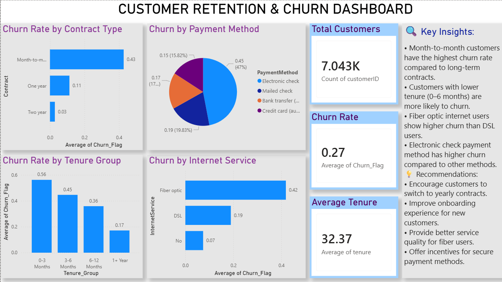

# FUTURE_DS_02 - Customer Retention & Churn Dashboard

## 📊 Project Overview
This project analyzes customer churn patterns using Power BI.

## 📌 Key Insights
- Month-to-month customers have the highest churn rate
- Customers with low tenure are more likely to churn
- Fiber optic users show higher churn compared to DSL
- Electronic check users have higher churn rates

## 💡 Recommendations
- Encourage long-term contracts
- Improve onboarding experience
- Improve service quality for fiber users
- Promote secure payment methods

## 🛠 Tools Used
- Power BI
- Excel

## 📷 Dashboard Preview

